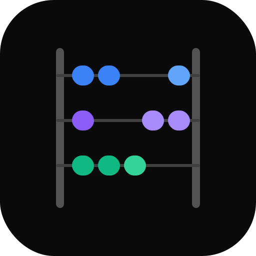
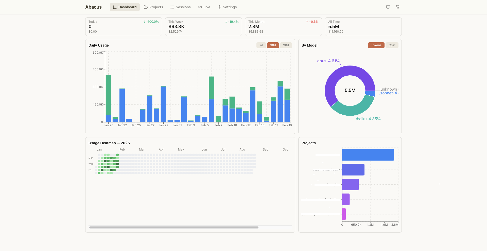
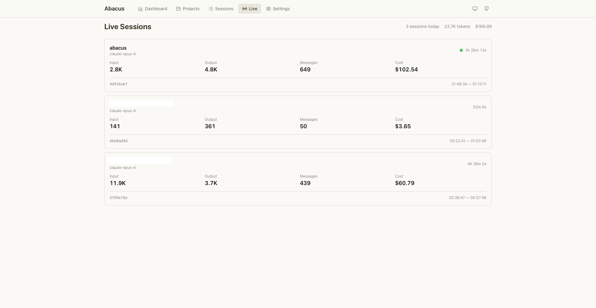

<p align="center">
  
</p>

<h1 align="center">abacus</h1>

<p align="center">
  A local dashboard for tracking your coding agent's token usage and costs.
  <br/>
  Currently supports <strong>Claude Code</strong>.
</p>

<p align="center">
  
  
  
  
  
  
</p>

---

<table>
  <tr>
    <td></td>
    <td></td>
  </tr>
</table>

## What it does

Abacus reads the JSONL logs that Claude Code writes to `~/.claude/projects/`, parses every token event, and renders usage dashboards — all locally, no external services.

1. **Dashboard** — daily usage chart, cost summary cards, breakdown by project and model. Compares current period against previous for trend detection.
2. **Projects** — per-project token usage with cost breakdowns.
3. **Sessions** — filterable table of every Claude Code session with token counts, costs, and durations. Filter by project, model, and date range.
4. **Live** — real-time view of active sessions, polling every 2 seconds. Shows elapsed time, running token counts, and costs.

## Quick Start

**Prerequisites:** Node.js 22+, pnpm

```bash
# 1. Clone and install
git clone https://github.com/maximilianfalco/abacus.git
cd abacus
pnpm install

# 2. Start the dev server
pnpm dev
```

Open [localhost:3456](http://localhost:3456). Abacus reads from `~/.claude/projects/` by default — if you've used Claude Code, you'll see data immediately.

<details>
<summary><strong>Environment variables</strong></summary>

Copy the example and adjust if needed:

```bash
cp apps/web/.env.example apps/web/.env.local
```

| Variable | Default | Description |
|---|---|---|
| `CLAUDE_DATA_PATH` | `~/.claude/projects` | Path to Claude Code JSONL log files |
| `APP_MODE` | `local` | `local`, `sender`, or `receiver` |
| `SYNC_ENDPOINT` | — | Remote endpoint for sender mode |
| `SYNC_API_KEY` | — | Shared secret for sync auth |
| `SYNC_INTERVAL_HOURS` | `1` | How often to sync (sender mode) |

</details>

## Docker

Run Abacus as a background container — no terminal needed.

```bash
docker compose up -d --build
```

This mounts `~/.claude/projects` read-only into the container. Open [localhost:3456](http://localhost:3456).

To stop:

```bash
docker compose down
```

<details>
<summary><strong>Build from source</strong></summary>

```bash
docker build -t abacus .
docker run -d -p 3456:3456 \
  -v ~/.claude/projects:/data/claude:ro \
  -e CLAUDE_DATA_PATH=/data/claude \
  --restart unless-stopped \
  abacus
```

</details>

## Project Structure

```
abacus/
├── apps/web/              Next.js 16 dashboard
│   ├── src/app/           Pages and API routes
│   └── src/components/    Nav, theme toggle
├── packages/parser/       JSONL reader, aggregator, cost calculator
└── packages/ui/           Shared chart components, hooks, formatters
```

| Package | What it does |
|---|---|
| `@abacus/web` | Next.js app — pages, API routes, layout |
| `@abacus/parser` | Reads Claude Code JSONL files, groups by session/day/week/month/project/model, calculates costs per model |
| `@abacus/ui` | Reusable chart components (daily usage, cost summary cards, session table), SWR data hooks, formatting utilities |

## Tech Stack

| Component | Choice |
|---|---|
| Framework | Next.js 16 (App Router, TypeScript) |
| UI | React 19, Tailwind CSS 4, shadcn/ui, Radix UI |
| Charts | Recharts |
| Data fetching | SWR |
| Monorepo | pnpm workspaces, Turborepo |
| Linting | ESLint 9, Prettier |
| Testing | Vitest |

## How It Works

The parser reads JSONL files from Claude Code's local data directory. Each line contains a token usage event with model, token counts (input, output, cache read, cache write), and session metadata.

The aggregation pipeline:

1. **Read** — streams all `.jsonl` files from the data directory
2. **Parse** — validates each line against a Zod schema, extracts token counts and model info
3. **Cost calculation** — applies per-model pricing (supports Claude Opus, Sonnet, Haiku across versions)
4. **Aggregate** — groups parsed lines into sessions, daily/weekly/monthly summaries, per-project and per-model breakdowns
5. **Serve** — Next.js API routes expose aggregated data, SWR hooks poll for live updates

## License

[MIT](LICENSE)
